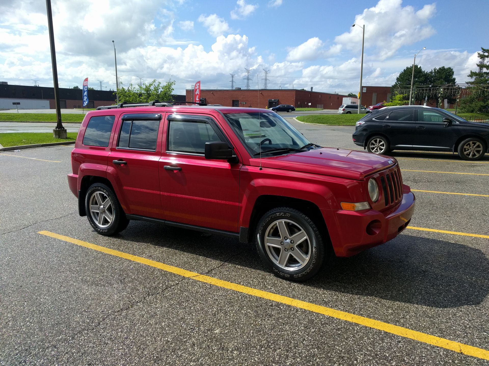

```json
{
  "title": "Arrived, got a car, changed plans",
  "lang": "en",
  "heroImages": [
    "2017-08-18/P8180088.JPG"
  ]
}
```



After two weeks in suburban Toronto, I finally managed to get an Ontario 
driver's license, a car and insurance for it! It was not an easy task, but that
will be part of another post written in German (coming soon™).

It's a 2008 Jeep Patriot, and I really like it!

Anyways, I had originally planned to do a trip to the United States after 
getting a car: Watch a day or two of golf at the [Solheim Cup](https://en.wikipedia.org/wiki/2017_Solheim_Cup)
in Des Moines (IA), visit my host family in Omaha (NE) and then watch the
[total solar eclipse](https://en.wikipedia.org/wiki/Solar_eclipse_of_August_21,_2017) 
on August 21st [somewhere south of Omaha](http://xjubier.free.fr/en/site_pages/solar_eclipses/TSE_2017_GoogleMapFull.html?Lat=40.24599&Lng=-96.38306&Zoom=8&LC=1).

### The Solheim Cup

The plan was to leave on Wednesday, but I had already extended my stay in Toronto
for another night, and I dind't start to make any detailed plans until I knew I
would have a car by Thursday. So on Wednesday afternoon, while waiting for the
car dealer to get the license plates ready, I looked at ticket prices for the
Solheim Cup.

It's $60 per day, which is fine, I didn't expect this to be cheap.
But, I have a car now (*yay!*), so what about parking? From their 
[FAQ](http://www.solheimcupusa.com/event-tickets/ticketing-faq):

> Q. Do I have to buy a parking pass for each day?  
A. It depends on which pass you purchase. The off-site parking pass ($35/week) provides weekly access (Monday-Sunday). The on-site Main Entrance parking pass is $40/day and you will need to select the specific day when buying.

That's... WTF?! I guess they want you to share a ride...

The thing with the Solheim Cup is that on Friday and Saturday (I probably would
have gone on Saturday), there are a maximum of four groups on the course at any
time. Everyone will obviously follow those four groups, so it will be crowded
as hell. I was a volunteer as a scorer at the 2015 Solheim Cup in Germany. I was
inside the ropes – it just doesn't get any better than that. So do I really need
to pay $100 for a day of golf where I will be staring at someone else's back most
of the time?

I wasn't so sure about that, so I checked the LPGA website to see if there's any
regular tournament I could watch. As it turns out, they're playing the
[Canadian Pacific Women\'s Open](http://www.cpwomensopen.com/) in Ottawa next week!

### The solar eclipse

My first idea was to just skip the Solheim Cup, but still drive down to Omaha,
visit my host family and watch the solar eclipse on Monday. If I left in Omaha by
Tuesday or Wednesday, I could still be in Ottawa to see the tournament on Friday
or Saturday.

So I checked the weather forecast for August 21st, and it wasn't very promising.
There was a strong chance of showers, which would mean that even when it's not
raining, the chance that it's cloudy would be even higher. I have already seen a
total solar eclipse when it's clouded ([southern Germany, 1999](https://en.wikipedia.org/wiki/Solar_eclipse_of_August_11,_1999)),
and there's nothing too spectacular about that – it just gets dark. 

The whole trip would have been a 3500 km drive. I really like my new car, but
driving down there to experience another total solar eclipse without seeing
anything special is a chance I wasn't willing to take. I spent a lot of time in
public transit in Toronto since I got here, so I really didn't feel like sitting
in a car for 36 hours within a week (or even two weeks).

Additionally, just because CO2 is cheaper in Northern America doesn't mean it's
doing any less damage to the environment. Just in case anyone cares, this would
have been roughly [800kg of CO2 emission](http://www.nrcan.gc.ca/energy/efficiency/transportation/cars-light-trucks/buying/16770).

### Last but not least

What's more, I just don't feel like going to the United States at the moment.

There's a flip side to everything. *America First* translates to *America Last*
for me. I'm guessing there's probably no clear definition of "Isolation" on Twitter,
so maybe not everyone in the US is aware of this: Voting populist will not just
keep Muslims out of your country.

I skipped a vacation to Florida in February partly because of this (I already
knew I was going to Canada at the time, so I also wanted to save the vacation
days and the money).

I was going to go this time because it seemed to be worth it. But all things
considered, I'm not going to throw my principles out the window for a slight
chance of seeing a corona. I did drink one on Monday afternoon though.

### What's next

I spent a couple of nights in my car and did some couchsurfing in Brighton and
Trenton. I'll be in Ottawa to watch some golf and the city, and I don't have any
idea what's after that. I will kepp you updated though!
